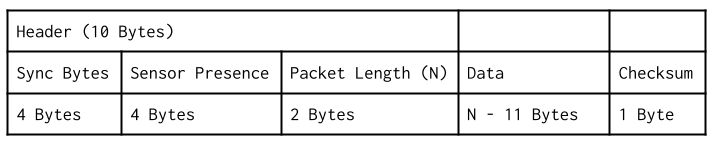
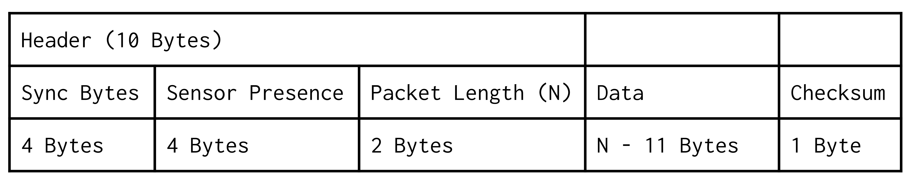

# More on The Packeting System

## Previous Iteration
Last semester our packets were text and csv based, with the first csv cell serving as a Header code. Iterating through the sensors, each sensor would append its csv fields onto the packet string and toggle its corresponding bit in the Header

## The Header 
The Header is a 32 bit unsigned integer that is treated like just an array of bits, so when a sensor’s data is added to the packet string, its corresponding bit is set. The procedure for setting each bit is as follows:

```
SHIFT Header left by 1
IF sensor is read
	Set leftmost Header bit to 1 (Header = Header | 1) (bitwise OR)
ELSE 
	Set leftmost Header bit to 0 (do nothing) 
```

So with a sensor setup defined as follows: 
| Sensor          | CSV Header snippet |
|-----------------|--------------------|
| Millis()        | “Millis, ”         |
| Temp            | “TempF,”           |
| BME280          | “TempC, PresshPa, RelHum%, ” |

Header starts as 0000 0000 0000 0001 with a bit for the header value itself as it is a cell in the csv
CSV Header starts as “Header, ” 

Then when a sensor is read in order ones are shifted in (in this case we’ll assume Temp is being skipped)

| Sensor Visited | Header Val (in hex) | CSV Header | CSV Row(dummy values) |
|----------------|---------------------|------------|-----------------------|
| Millis         | 0000 0000 0000 0011 | “Header, Millis, ” | “(header val), 84949, ” |
| Temp           | 0000 0000 0000 0110 | “Header, Millis, ” | “(header val), 84949, ” |
| BME280         | 0000 0000 0000 1101 | “Header, Millis, TempC, PresshPa, RelHum%, ” | “(header val), 84949, 18, 30, 15, ” |

So when this is decoded the header is populated by a header with corresponding definitions in the ground software, which lets them know what the values mean. 

## Changes for this iteration
This semester, expanding on those ideas, the new packeting scheme uses the same logic, but without the data values being stored as csv strings. This scheme relies on an understanding of pointers, if you’re not familiar with pointers I would recommend reviewing them, here’s a helpful short video: https://www.youtube.com/watch?v=2ybLD6_2gKM 


So instead we start with 

Header for the system as 0000 0000 0000 0000 (now called sensor presence as Header becomes more complex) 

And the packet as an array of uint8_t (plain bytes) 

#### Packet Definition 
<!--  -->


### Header
#### ID/Sync Bytes
These are predefined identifier bytes that allow the ground station to determine when a packet begins (4 Bytes).
#### Sensor Presence
This serves the same purpose as last semester’s Header, 4 bytes has enough bits for all of our sensors
#### Packet Length
The length of the entire packet in bytes. This is 2 bytes as an unsigned integer.

### Data 
This is the largest difference for the packet this semester. Rather than encoding each value as characters and then transmitting a csv line, instead we are packing those values together. This allows for the packet to be smaller as instead of a byte for each character, we can represent numbers directly. For example, 8 bits as a character can only hold 10 values (0 to 9), but 8 bits as a number can hold 256 values (from 0 to 256 or -128 to 127). 

To do this we use the copy function to transfer bytes directly from each value into the packet, then increment the packet, which as a pointer will then be used by the next sensor as the position to start writing its data. Another syntax thing to understand is that in C++ the & on an argument’s data type indicates that it will be passed by reference, which means that the argument when changed and used is really changing and using the variable passed to it. In our case, incrementing the packet argument of the function will increment the packet variable passed to it, allowing each sensor to move the packet pointer as they add value to the packet.

The parent class functions that sensors need to override to implement the packeting system are 
```
/**
* @brief Used for creating packets, reads data from the sensor and appends it
* to the passed uint8_t array pointer, incrementing it while doing so
*
* @param packet Pointer to the packet byte array
* @return int The number of bytes appended
*/
void readDataPacket(uint8_t*& packet) {};


/**
* @brief Used for onboard decoding of packets
*
* @param packet  Pointer to the packet byte array
* @return String The senors data decoded from the packet in csv format
*/
String decodeToCSV(uint8_t*& packet) { return ""; };
```

And then an example of implementation from the Temperature Sensor class
```
void TempSensor::readDataPacket(uint8_t*& packet) {
  // read sensor value to a variable
  float temp = analogReadTemp();


  // cast the pointer to that value to a uint8_t pointer, copy the bytes at that pointer to packet (using the size of the variable to tell copy the number of bytes to copy)
  std::copy((uint8_t*)(&temp), (uint8_t*)(&temp) + sizeof(temp), packet);
  // increment the packet pointer past the new bytes
  packet += sizeof(temp);
}
```
And then to decode we do the opposite (this will be used for testing the packet system and debugging in the time before the ground station decoding is set up) 
```
String TempSensor::decodeToCSV(uint8_t*& packet) {
  // cast the packet pointer to pointer of the data type to read (float) then
  // dereference it
  float temp;
  memcpy(&temp, packet, sizeof(float));


  // increment packet by the size of the read data type (float)
  packet += sizeof(temp);


  // return in csv snippet format
  return String(temp) + ",";
}
```
This all works because in C++, you can tell your program to interpret any pointer as any other pointer, which, to encode the data, lets us fake the data pointer being a pointer to a uint8_t array which can then be read byte by byte into the packet. And then to decode the packet, copy the data in reverse from the packet array to the appropriate data type variable. 

NOTE: Before this we did recommend casting the pointer to decode the packet, which is something that would be allowed in C++ on, for instance, your computer, but we have since discovered that on the ARM processor we use, it will crash if that cast makes it read in a way that breaks their assumption that variables we word-aligned

These functions are then called in a parent class function that implements the sensor presence bit setting logic similar to the previous semester, allowing a packet to have any combination of sensor data in it, while still being decodable to the ground station. 

### Checksum
Finally, the last part of the packet is a checksum, which is used to determine if there have been any bits flipped in the rest of the packet. You can read more about how they work here: https://en.wikipedia.org/wiki/Checksum. But essentially it relies on the rest of the packet to set its value and can be calculated by the ground station to check if it matches with what is transmitted, and if it isn’t there are bits that are wrong. 